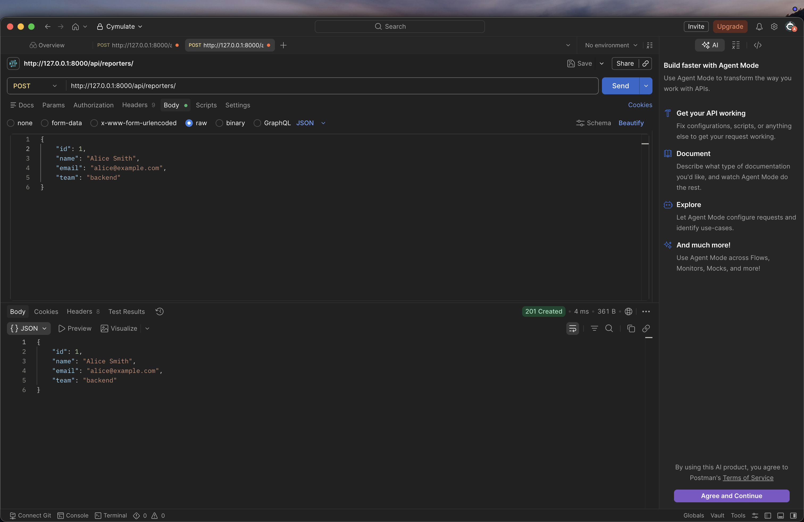
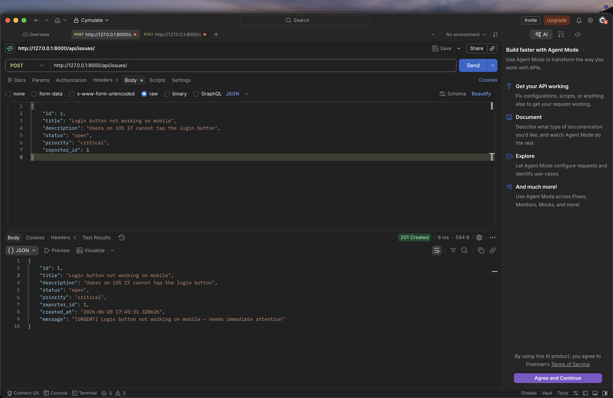
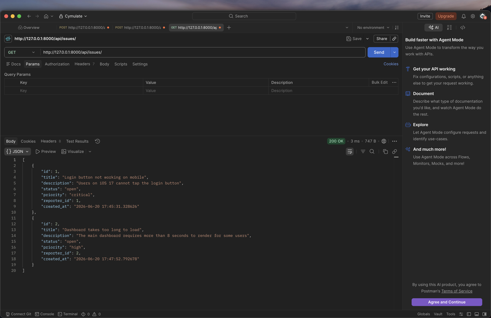
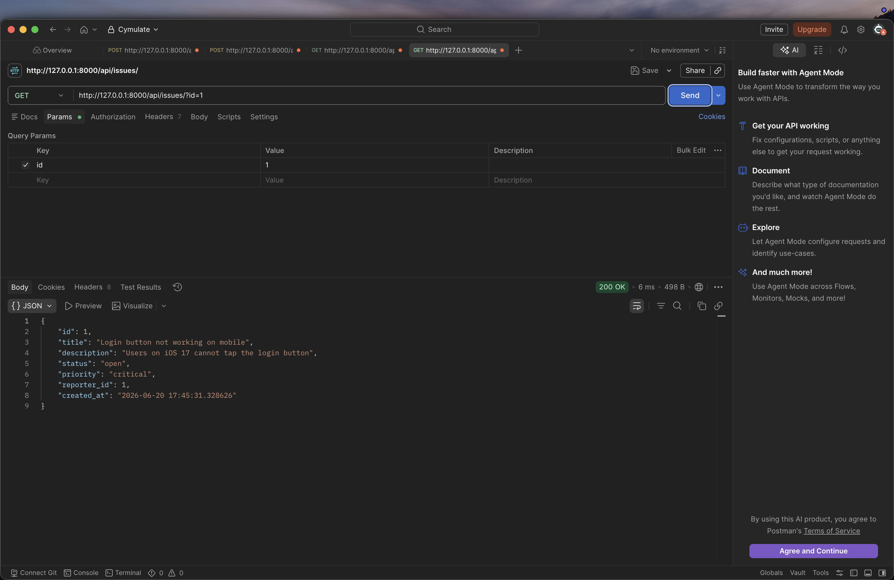
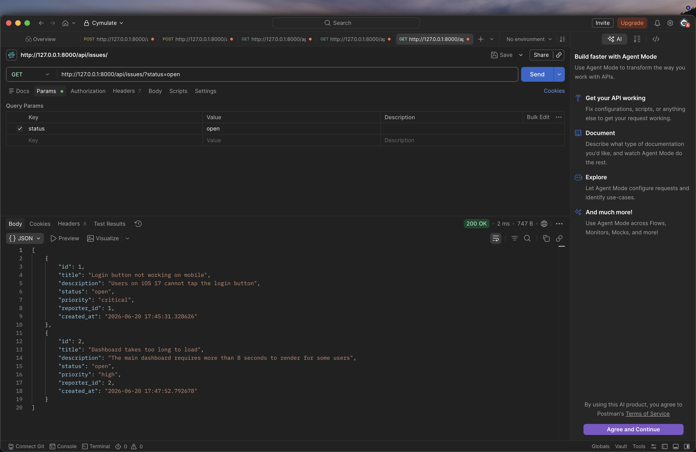
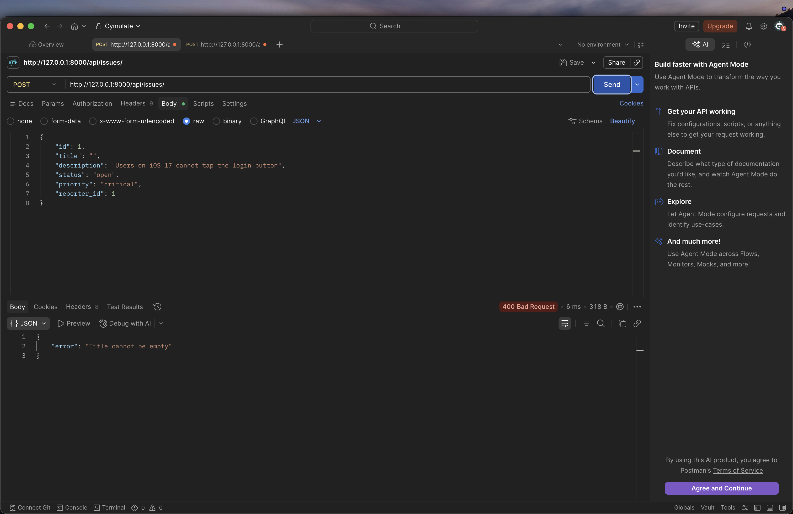
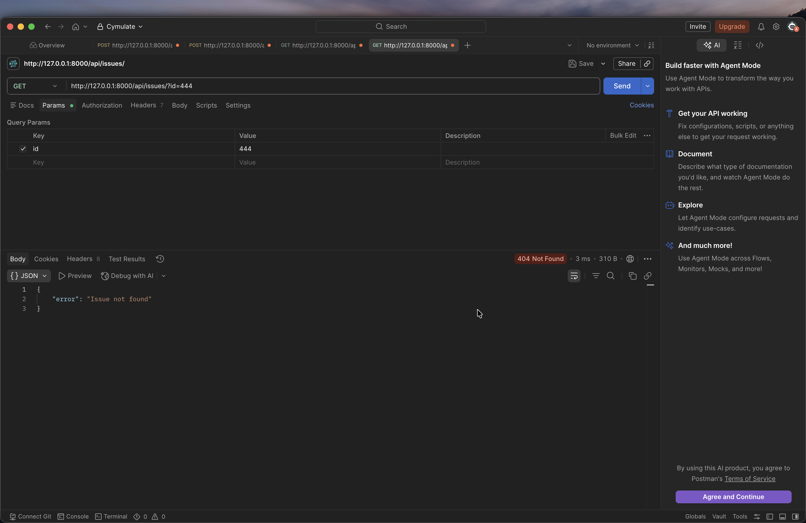

# DevTrack - Issue Tracker API

A minimal Django backend API for tracking engineering issues. Engineers can report bugs, assign priorities, and track status - similar to a stripped-down GitHub Issues.

---

## How to Run

```bash
# 1. Activate the venv
source .venv/bin/activate

# 2. Move into the Django project
cd Issue_tracker

# 3. Start the dev server
python manage.py runserver
```

Server runs at `http://127.0.0.1:8000/`

---

## Endpoints

### Reporter Endpoints

| Method | URL | Description |
|--------|-----|-------------|
| `POST` | `/api/reporters/` | Create a new reporter |
| `GET` | `/api/reporters/` | Get all reporters |
| `GET` | `/api/reporters/?id=1` | Get a single reporter by ID |

**POST `/api/reporters/` - Request body:**
```json
{
  "id": 1,
  "name": "Alice Smith",
  "email": "alice@example.com",
  "team": "backend"
}
```

**Response - 201 Created:**
```json
{
  "id": 1,
  "name": "Alice Smith",
  "email": "alice@example.com",
  "team": "backend"
}
```

---

### Issue Endpoints

| Method | URL | Description |
|--------|-----|-------------|
| `POST` | `/api/issues/` | Create a new issue |
| `GET` | `/api/issues/` | Get all issues |
| `GET` | `/api/issues/?id=1` | Get a single issue by ID |
| `GET` | `/api/issues/?status=open` | Get all issues filtered by status |

**POST `/api/issues/` - Request body:**
```json
{
  "id": 1,
  "title": "Login button not working on mobile",
  "description": "Users on iOS 17 cannot tap the login button",
  "status": "open",
  "priority": "critical",
  "reporter_id": 1
}
```

**Response - 201 Created:**
```json
{
  "id": 1,
  "title": "Login button not working on mobile",
  "description": "Users on iOS 17 cannot tap the login button",
  "status": "open",
  "priority": "critical",
  "reporter_id": 1,
  "created_at": "2026-06-20 ...",
  "message": "[URGENT] Login button not working on mobile - needs immediate attention"
}
```

**Response - 400 Bad Request (validation failure):**
```json
{ "error": "Title cannot be empty" }
```

**Response - 404 Not Found:**
```json
{ "error": "Issue not found" }
```

---

## Valid Field Values

| Field | Allowed values |
|-------|---------------|
| `status` | `open`, `in_progress`, `resolved`, `closed` |
| `priority` | `low`, `medium`, `high`, `critical` |

---

## Postman Screenshots

### Success Cases

**POST `/api/reporters/` - 201 Created**



**POST `/api/issues/` - 201 Created (critical issue with URGENT message)**



**GET `/api/issues/` - 200 List all issues**



**GET `/api/issues/?id=1` - 200 Single issue**



**GET `/api/issues/?status=open` - 200 Filtered by status**



### Failure Cases

**POST `/api/issues/` - 400 Bad Request (empty title)**



**GET `/api/issues/?id=444` - 404 Not Found**



---


## Project Structure

```
Issue_tracker/
├── manage.py
├── issues.json
├── reporters.json
├── Issue_tracker/
│   ├── settings.py
│   └── urls.py
└── issues/
    ├── models.py
    ├── views.py
    └── urls.py
```
